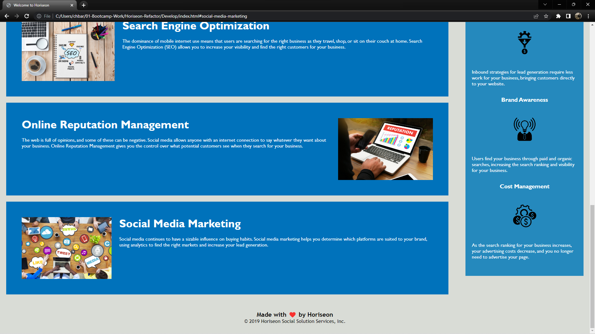

# <Horiseon-Refactor>

## Description

The aim of the project was to refactor the code of the Horiseon website. The website's HTML and CSS needed to be reviewed to insure that it was up to standards of accesibility. The code, which has now been corrected, solved the issues as well as left the code more cleaned up and refined. Through working on this project I learned what to look out for when coding and began building good habits for future code review. 

## Screenshots

## Link

https://cbarnes0.github.io/Horiseon-Refactor/